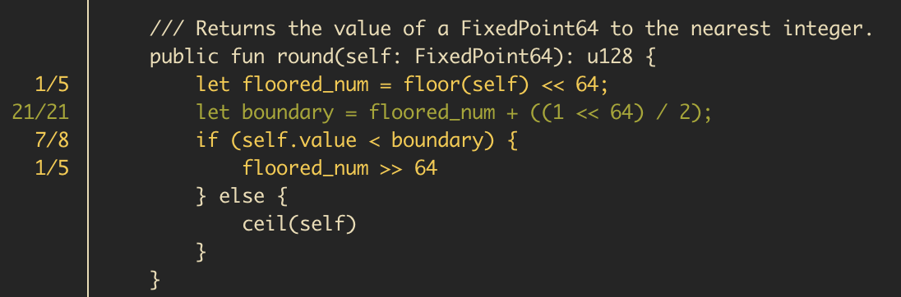

## Overview

**Mutation testing** with Move offers a glimpse into how we can bolster the robustness of smart contract specifications, increasing overall assurance for developers working on the Aptos blockchain. Mutation testing introduces deliberate faults (mutants) to source code to test the quality of existing tests. It's a robust method to identify blind spots that traditional coverage tools might miss. To address this, in this repo we are providing three tools, to help developers identify and eliminate potential weak spots in their tests and code's specifications.


[**`move-mutation-test`**](move-mutation-test/README.md) is a tool used to test the quality of the test suite and the source code.
How it works:
1. Runs tests on the original source code to ensure the original tests are valid.
2. Internally runs the [**`move-mutator`**](move-mutator/README.md) tool to generate mutants.
3. Runs the tests for all mutants to check if the mutants are killed by the original test suite.

If the mutants are not killed, it might indicate the quality of the test suite could be improved, or in some rare cases, it might indicate an error in the original source code.

[**`move-spec-test`**](move-spec-test/README.md) is a tool used to test the quality of the Move specifications.
How it works:
1. Runs the _Move Prover_ on the original source code to ensure the original specification is valid.
2. Internally runs the [**`move-mutator`**](move-mutator/README.md) tool to generate mutants.
3. Runs the _Move Prover_ tool on all mutants to check if the mutants are killed (so _Prover_ will catch an error) by the original specifications.

If some mutants are not killed, it means that the specification has issues and is incorrect or not tight enough to catch such cases, so it should be improved.

[**`move-mutator`**](move-mutator/README.md) is a helper tool that mutates Move source code. Every modification / mutation is called a mutant. _Note that the tool mutates only the source code; tests and spec blocks are unaffected and are not mutated by this tool._

## Quick introduction to mutation tools

This is a quick tutorial on how the `move-mutation-test` tool should be used. Install the tool with:

```
$ RUSTFLAGS="--cfg tokio_unstable" cargo install --git https://github.com/eigerco/move-spec-testing.git --locked move-mutation-test
```

### Example usage for the `aptos-stdlib` project

The tool mutates the original code and then reruns the tests for each mutation. Each code mutation is named the _mutant_.
- If the test suite is passing for the mutant, it indicates the test suite could be improved (because despite the code being mutated, the tests passed), or in some rare cases - that the original code should be improved.
- If the test suite fails for the generated mutant, that's an indication the test suite is well written.

The tool can be slow for whole programs (depending on a number of factors such as the number of mutants generated, compilation and test execution time), so the recommended way to use it is on a per-module or per-function basis.

The tools are started by using the `run` subcommand. The other subcommand is called `display-report`, which can be used to parse the results after the `run` subcommand finishes.

Let's try the tool in the `aptos-stdlib` project and let's select the `fixed_point64` module to scan the mutants. We'll use the `--coverage` flag to ensure mutated code is generated only on pieces of the code that have proper unit test coverage:

```bash
move-mutation-test run --coverage --output report.txt --mutate-modules fixed_point64
```

> [!IMPORTANT]  
> To use the `-coverage` flag, the user first needs to run the `aptos move test --coverage` command to generate the coverage report stored locally within the project files.

<p align="center"></p>

Once the execution is done, we should see this short summary that tells us the number of alive mutants per function in the module.

<p align="center"></p>

It seems like the function `round` has nine surviving mutants. Use the following command to see the results more clearly:

```bash
move-mutation-test display-report coverage --path-to-report report.txt
```

<p align="center"></p>

If we scroll further down, we should find the `round` function where we can see the lines with info regarding the alive and killed mutants:

<p align="center"></p>

This is a cool overview of the state of the function, but it doesn't tell us which mutants survived. For that purpose, we can use the `mutants` subcommand:

```bash
move-mutation-test display-report mutants --modules fixed_point64 --functions round
```

<p align="center"></p>

The next step would be to check the current state of the tests and see how we can write some tests that would ensure these mutants would fail the test suite.

<p align="center"></p>

From the above, we can see that the tests that are trying to test the `round` function could be improved a lot.
Let's try to improve these tests with the below:

<p align="center"></p>

Now, let's rerun the tool, but let's be more specific this time to make the execution shorter, let's mutate only the `round` function with the command:

```bash
move-mutation-test run --coverage --output report.txt --mutate-modules fixed_point64 --mutate-functions round
```

<p align="center"></p>

We can already see from the summary report that the stats for this function have improved!

Let's again check the coverage with the `display-report coverage` command:

```bash
move-mutation-test display-report coverage
```

<p align="center"></p>

And that's it! We just used the tool to improve our test suite.

If you want to learn more, feel free to explore the tool.
Or even maybe try to improve the test in order to kill the remaining mutant here:

```bash
move-mutation-test display-report mutants --modules fixed_point64 --functions round
```

<p align="center"></p>

_In this quick showcase above, we presented how the `move-mutation-test` tool should be used to improve the test suites - but in the same fashion, the `move-spec-test` tool can be used to improve formal verification, the `display-report` subcommands are the between these two mutation tools._

## Documentation

To dive more deeply into each tool, please check out the documentation here:

 - [`move-mutator` documentation](move-mutator/README.md)
 - [`move-mutation-test` documentation](move-mutation-test/README.md)
 - [`move-spec-test` documentation](move-spec-test/README.md)

## License

All tools in this repo are released under the open source [Apache License](LICENSE)

## About [Eiger](https://www.eiger.co)

We are engineers. We contribute to various ecosystems by building low level implementations and core components. We built these tools because we believe in Move. We are happy to contribute to the Aptos ecosystem and will continue to do so in the future.

Contact us at hello@eiger.co
Follow us on [X/Twitter](https://x.com/eiger_co)