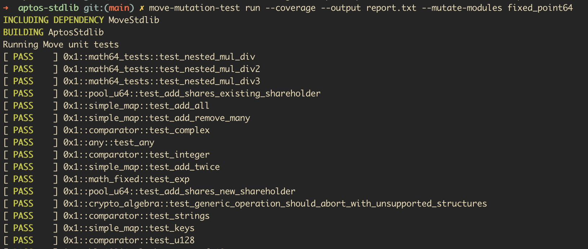
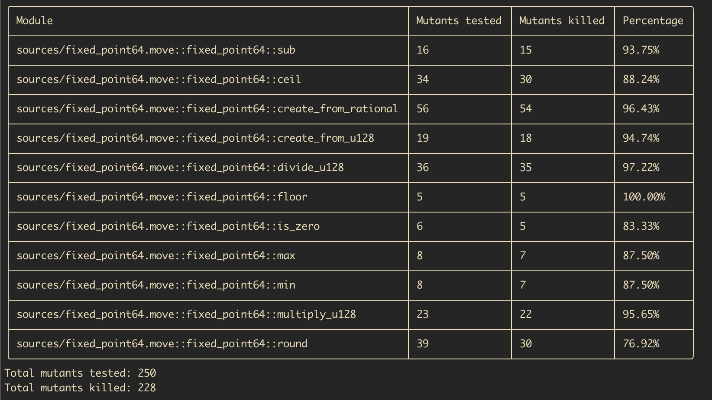
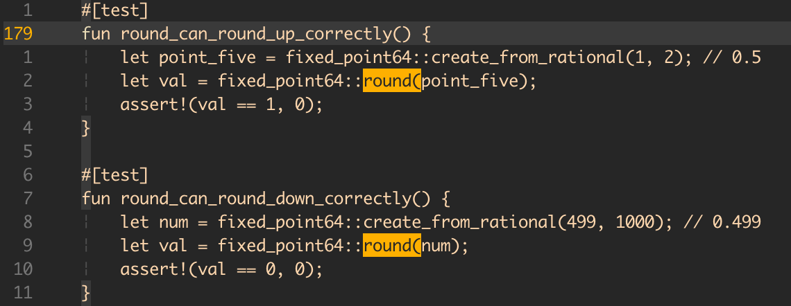
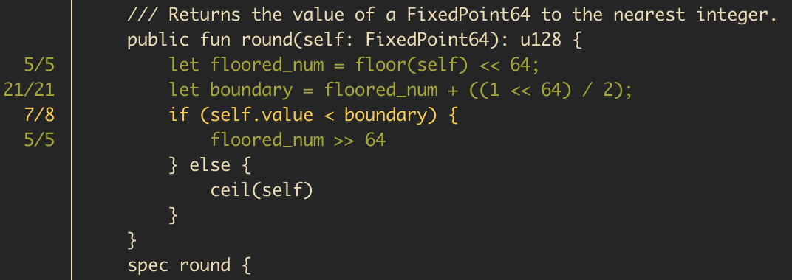

# How to use mutation tools

This is a quick tutorial on how the `move-mutation-test` tool should be used.

The `move-mutation-test` can be used to improve Move unit tests, by identifying possible blind spots in tests. A similar tool, the `move-spec-test`, can be used to improve Move specifications.

_In this quick showcase below, only the `move-mutation-test` tool is presented, but the commands are the same for the `move-spec-test` tool, so it works in a similar way._

## Example tool usage for the `aptos-stdlib` project

The tool mutates the original code and then reruns the tests for each mutation. Each code mutation is named the _mutant_.
- If the test suite is passing for the mutant, it indicates the test suite should be improved (because despite the code being mutated, the tests passed), or in some rare cases - that the original code should be improved.
- If the test suite fails for the generated mutant, that's an indication the test suite is well written.

The tool can be slow for whole programs (depending on a number of factors such as the number of mutants generated, compilation and test execution time), so the recommended way to use it is on a per-module or per-function basis.

The tools are started by using the `run` subcommand. The other subcommand is called `display-report`, which can be used to parse the results after the `run` subcommand finishes.

Let's try the tool in the `aptos-stdlib` project and let's select the `fixed_point64` module to scan the mutants. We'll use the `--coverage` flag to ensure mutated code is generated only on pieces of the code that have proper unit test coverage:

```bash
move-mutation-test run --coverage --output report.txt --mutate-modules fixed_point64
```

> [!IMPORTANT]  
> To use the `-coverage` flag, the user first needs to run the `aptos move test --coverage` command to generate the coverage report stored locally within the project files.

<p align="center"></p>

Once the execution is done, we should see this short summary that tells us the number of alive mutants per function in the module.

<p align="center"></p>

It seems like the function `round` has nine surviving mutants. Use the following command to see the results more clearly:

```bash
move-mutation-test display-report coverage --path-to-report report.txt
```

<p align="center"></p>

If we scroll further down, we should find the `round` function where we can see the lines with info regarding the alive and killed mutants:

<p align="center"></p>

This is a cool overview of the state of the function, but it doesn't tell us which mutants survived. For that purpose, we can use the `mutants` subcommand:

```bash
move-mutation-test display-report mutants --modules fixed_point64 --functions round
```

<p align="center"></p>

The next step would be to check the current state of the tests and see how we can write some tests that would ensure these mutants would fail the test suite.

<p align="center"></p>

From the above, we can see that the tests that are trying to test the `round` function could be improved a lot.
Let's try to improve these tests with the below:

<p align="center"></p>

Now, let's rerun the tool, but let's be more specific this time to make the execution shorter, let's mutate only the `round` function with the command:

```bash
move-mutation-test run --coverage --output report.txt --mutate-modules fixed_point64 --mutate-functions round
```

<p align="center"></p>

We can already see from the summary report that the stats for this function have improved!

Let's again check the coverage with the `display-report coverage` command:

```bash
move-mutation-test display-report coverage
```

<p align="center"></p>

And that's it! We just used the tool to improve our test suite.

If you want to learn more, feel free to explore the tool.
Or even maybe try to improve the test in order to kill the remaining mutant here:

```bash
move-mutation-test display-report mutants --modules fixed_point64 --functions round
```

<p align="center"></p>